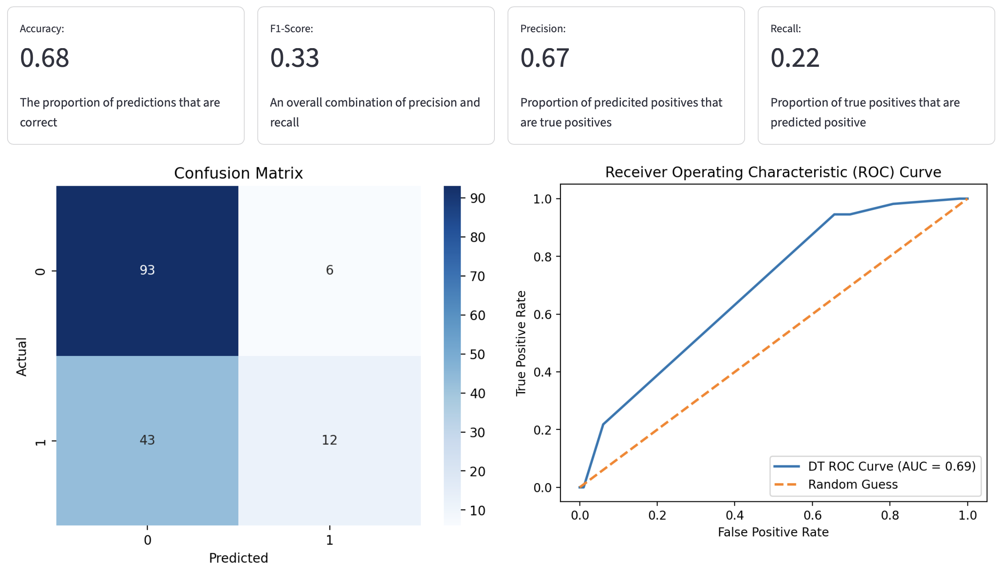

# Machine Learning Wizard App! 🧙

## Project Overview
The goal of this project was to create a fully customizable app to explore machine learning models!
In an easily understandable layout, the user can explore this app, analyzing a variety of datasets and results!

## Instructions
To run this app, do the following:
1. Install the required libraries and tools
2. Download the required files, including the sample data and main.py
3. Download any data you would like to use in a CSV format
4. In your terminal, navigate to the folder where this information is located, by typing **cd {location}**
5. Then, type the code **streamlit run main.py**
6. Have fun with the app!

## App Features
The app features interactive data uploading and selection, and four machine learning models!
1. Linear Regression
  - For predicting a continuous numeric variable this model can be super useful!
  - Users can choose to drop missing values or scale data
2. Logistic Regression
  - This model is awesome for predicting binary outcomes!
  - User can choose to drop missing values or scale data
3. Decision Tree Classifier
  - For classification, this model is one of the best!
  - User can choose to drop missing values, scale data, and specify max depth, min leaf size, and criterion, all defined within the app!
4. K-Nearest-Neighbors Classifier
  - This model is also great for classification!
  - User can choose to drop missing values, scale data, and specify number of neighbors and weighting schema, all defined within the app!

## Example App Output!

## References
If you are interested in learning more, here are some useful links!
- [Machine Learning in Python](https://www.geeksforgeeks.org/machine-learning/machine-learning-with-python/)
- [SciKit-Learn Machine Learning Guide](https://scikit-learn.org/stable/supervised_learning.html)
- [Streamlit API](https://docs.streamlit.io/develop/api-reference)
