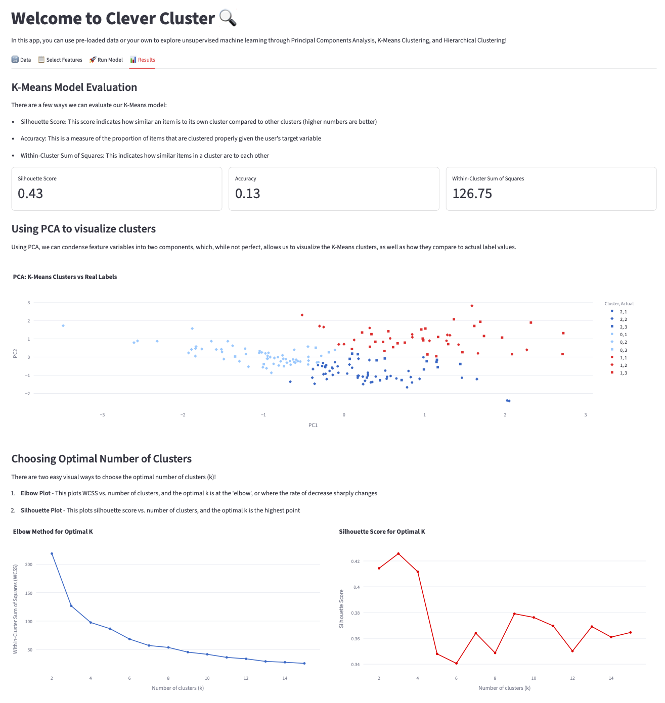

# Welcome to Clever Cluster 🔍
### This is my unsupervised machine learning app!

What is unsupervised machine learning?
Unsupervised machine learning is a group of algorithms that can tell us important information about data without having a **label**!

### App Features
Clever Cluster allows users to select between **3** unsupervised machine learning types!
1. Principal Components Analysis: This model uses combines variables into latent features that allows it to reduce dimensionality!
2. K-Means Clustering: This model uses cluster means to group similar observations!
3. Hierarchical Clustering: This model uses sequential clustering to group similar observations!

Some highlights of the app!
- Users can upload a dataset or select a sample
- Users can edit their data and select important model inputs
- With K-Means, users have the option to select a label column and compare it with unsupervised groupings

### Example Output

### Instructions
The recommended way to access the app is via [Streamlit Cloud](https://clevercluster.streamlit.app)

You can also run this app locally! To run this app, do the following:
- Install the required libraries and tools
- Download the required files, including the sample data and main.py
- Download any data you would like to use in a CSV format
- In your terminal, type the code streamlit run MLUnsupervisedApp/main.py
- Have fun with the app!

### Datasets
I have included two sample datasets! \n\n
[**Palmer's Pengiuns**](https://www.kaggle.com/datasets/mustafabozka/palmers-penguins) \n\n
- The penguin dataset is great for clustering and testing with a label! \n\n
[**Wine Quality**](https://www.kaggle.com/datasets/tawfikelmetwally/wine-dataset) \n\n
- The wine dataset is great for PCA, clustering, and testing with a label!

### Further Learning
[What is Unsupervised Machine Learning](https://www.geeksforgeeks.org/machine-learning/unsupervised-learning/)
[Sci-Kit Learn Clustering Documentation](https://scikit-learn.org/stable/modules/clustering.html)

