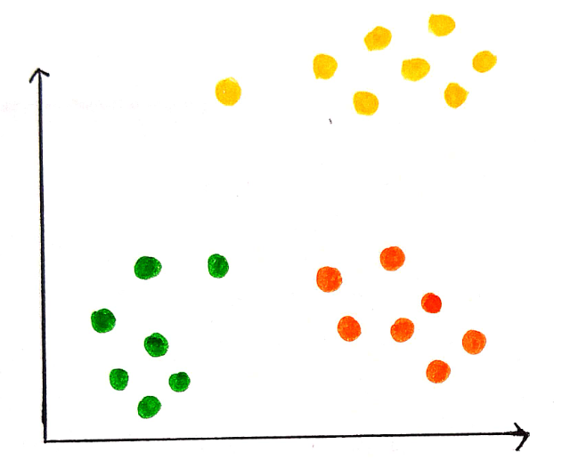

# Nathan Cox Data Science
This portfolio will contain all code and projects for an Introduction to Data Science course. This semester, I will be learning a variety of data science skills and applying them to several projects. As I complete projects, they will be updated here! Check back for projects in data analysis, visualization, and modeling!

1. [Exploring Music Popularity and Genre](./basic_streamlit_app)  
<table>
  <tr>
    <td>
      
    </td>
    <td>
      This is my first data science project, and I analyze Spotify music data! I use several types of visualizations to analyze the relationships
      between song features and popularity.
      More information can be found at the link above.
    </td>
  </tr>
</table>

2. [Gender Equality in Olympic Sports](./TidyData-Project)  
<table>
  <tr>
    <td>
      
    </td>
    <td>
      This is my second data science project, and I analyze Olympic medal data!
      This project demonstrates newly-learned skills in data cleaning and processing in order to gain gender insights in the Olympics.
      I apply tidy data principles, and once the data has been processed, we can easily learn about Olympic gender equality.
      More information can be found at the link above.
    </td>
  </tr>
</table>

3. [Machine Learning Wizard App](./MLStreamlitApp)  
<table>
  <tr>
    <td>
      
    </td>
    <td>
      This is my third data science project, and I build a machine learning app!
      This project demonstrates newly-learned skills in supervised machine learning, Streamlit integration, and a variety of models, including linear and logistic regression, decision trees, and k-nearest-neighbors.
      More information can be found at the link above.
    </td>
  </tr>
</table>

4. [Clever Cluster App](./MLUnsupervisedApp)  
<table>
  <tr>
    <td>
      
    </td>
    <td>
      This is my fourth data science project, and I build an unsupervised machine learning app!
      This project demonstrates newly-learned skills in unsupervised machine learning and how to apply it in a Streamlit app! I utilize Principal Components Analysis, K-Means Clustering, and Hierarchical Clustering in my most interactive app yet!
      More information can be found at the link above.
    </td>
  </tr>
</table>

## Links to Code and Projects:
[Spotify Exploratory Data Analysis](./basic_streamlit_app)  
[Olympics Tidy Data Project](./TidyData-Project)  
[Machine Learning Wizard App](./MLStreamlitApp)  
[Clever Cluster App](./MLUnsupervisedApp)
