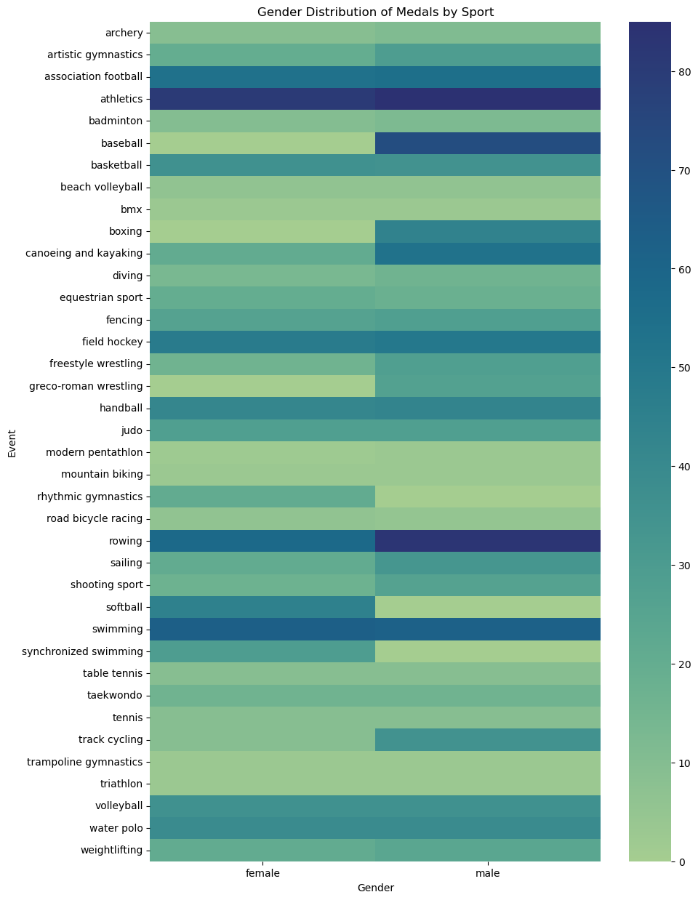

## Welcome to my Tidy Data Project!

This is my second project in Introduction to Data Science, and utilizes a Jupyter Notebook to clean and analyze 2008 Summer Olympics data.
This data contains information on athlete name, gender, and whether or not they received a medal in every event. 
When first loaded, this data is in a messy format, so Pandas techniques are utilized to clean the data and put it in a Tidy Data format.

Then, it can be visualized and analyzed. I hope you find this project insightful and enjoy it!

Here's a sneak peek of one of my visualizations!

