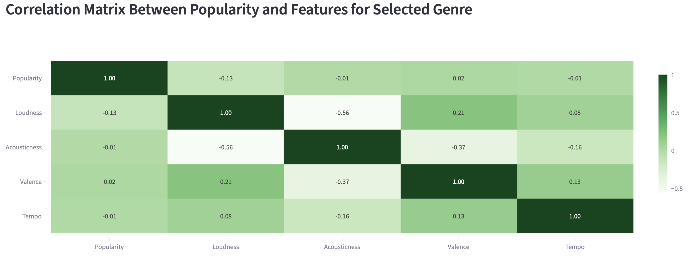

# Exploring Music Popularity by Genre and Feature

Welcome to my first data science project! This is an exploratory data analysis for the [Spotify Tracks Dataset](https://www.kaggle.com/datasets/maharshipandya/-spotify-tracks-dataset?resource=download)
on Kaggle. In this
analysis, I have built an app using Streamlit to visualize this data. In the app, you can select genre and feature,
and see how these factors change popularity, as well as learn about some new songs to listen to!

How to run this app:
- Install necessary packages and download content
- In your computer terminal, type **cd {folder files are stored in (e.g. basic_streamlit_app}**
- Then, run the code **streamlit run main.py**

Utilizing features such as:
- Loudness
- Acousticness
- Valence
- Tempo

This app explores their relationship with popularity through:
- Histograms
- Correlation Matrices
- Scatterplots
- Violin Plots

I am excited for my first project and I hope you enjoy it!

Here is an example from the app for my favorite music genre, country!

